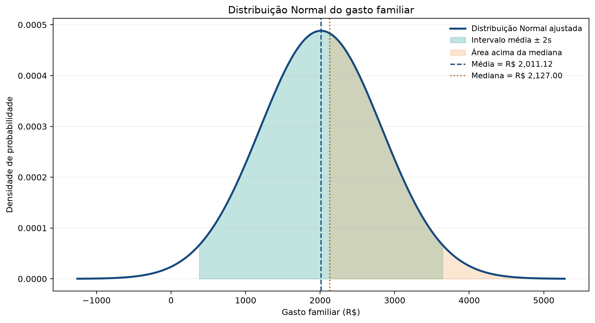
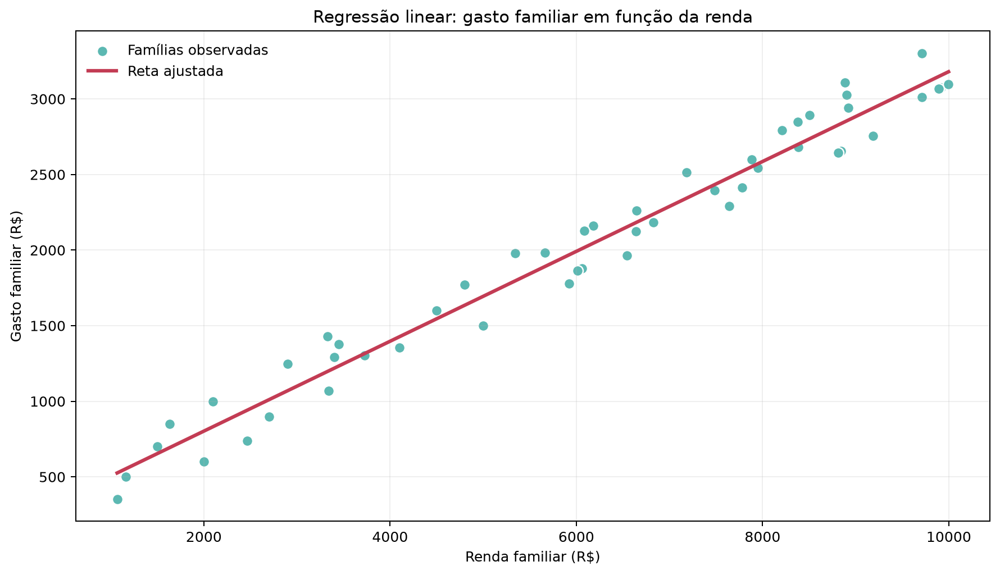

# Sprint 3 - Modelagem Linear para Aprendizado de Máquina

FIAP - Aclimação · Ciências da Computação  
Disciplina: Estatística com Python · São Paulo, 2026  
## Integrantes

ARTHUR MAZIVIERO FARIA - RM 573928  
JUN UEHARA - RM 570537  
FELIPE DE SOUZA GALLO - RM 569680  
ROBERSON REGUERO LUIZ JUNIOR - RM 573031  
TOMMASO CONCEIÇÃO NAGLIATTI - RM 572147  
MATHEUS MARTINS LACERDA - RM 570843

## 1. Objetivo e base de dados

Analisar o gasto familiar sob a hipótese de Distribuição Normal e ajustar uma Regressão Linear Simples para explicar o gasto em função da renda. A base didática contém 50 famílias, com as variáveis `renda_familiar` e `gasto_familiar`, em reais. `id_familia` identifica cada observação. `autores_trabalho` registra todos os integrantes e RMs. Ambas são excluídas do modelo. A base é a alternativa didática ajustada permitida pelo enunciado.

A análise utiliza Python, pandas, NumPy, SciPy, scikit-learn e Matplotlib. O notebook está preparado para execução no Google Colab.

## 2. Critério de classificação

| Probabilidade | Classificação |
| --- | --- |
| De 0% até 5% | Raro |
| Acima de 5% até 25% | Pouco provável |
| Acima de 25% até 75% | Provável |
| Acima de 75% até 100% | Quase certo |

Essas faixas são critérios adotados pelo projeto. Probabilidades fora de [0, 1] são rejeitadas.

## 3. Probabilidade acima da mediana

A Normal foi parametrizada pela média e pelo desvio padrão amostral do gasto, calculado com `ddof=1`.

```python
gastos = dados['gasto_familiar']
media = gastos.mean()
mediana = gastos.median()
desvio = gastos.std(ddof=1)
prob_acima_mediana = norm.sf(mediana, loc=media, scale=desvio)
```

| Indicador | Resultado |
| --- | ---: |
| Média | R$ 2.011,12 |
| Mediana | R$ 2.127,00 |
| Desvio padrão amostral | R$ 817,21 |
| P(X > mediana) | 44,3619% |
| Classificação | Provável |

A probabilidade é aproximadamente 44,36%. Ela difere de 50% porque o ponto de corte é a mediana da amostra, enquanto a distribuição teórica é centrada na média amostral. Não se trata da proporção empírica de registros acima da mediana.

## 4. Probabilidade no intervalo média ± 2s

```python
limite_inferior = media - 2 * desvio
limite_superior = media + 2 * desvio
prob_intervalo = (
    norm.cdf(limite_superior, loc=media, scale=desvio)
    - norm.cdf(limite_inferior, loc=media, scale=desvio)
)
```

| Indicador | Resultado |
| --- | ---: |
| Limite inferior | R$ 376,69 |
| Limite superior | R$ 3.645,55 |
| Probabilidade | 95,4500% |
| Classificação | Quase certo |

Sob a hipótese Normal, o intervalo concentra aproximadamente 95,45% da probabilidade. Esse resultado corresponde à regra de dois desvios padrão da Normal; não comprova que os dados seguem essa distribuição.



## 5. Regressão Linear Simples

O gasto é a variável dependente e a renda é a variável explicativa. O ajuste usa mínimos quadrados.

```python
X = dados[['renda_familiar']]
y = dados['gasto_familiar']
modelo = LinearRegression().fit(X, y)
previsoes = modelo.predict(X)
r2 = r2_score(y, previsoes)
rmse = np.sqrt(mean_squared_error(y, previsoes))
```

**Equação estimada:** gasto = 207,9033 + 0,2973 × renda.

| Parâmetro ou métrica | Estimativa |
| --- | ---: |
| Intercepto | 207,9033 |
| Coeficiente angular | 0,2973 |
| R² | 0,9699 |
| RMSE | R$ 140,36 |

O intercepto corresponde ao gasto previsto quando a renda é zero. Como esse valor está fora da faixa observada, sua interpretação é matemática e envolve extrapolação.

Cada R$ 1,00 adicional de renda está associado a cerca de R$ 0,2973 de gasto adicional previsto. Usando o coeficiente sem arredondamento, R$ 1.000,00 adicionais correspondem a aproximadamente R$ 297,29.

O R² indica que cerca de 96,99% da variação dos gastos é explicada linearmente pela renda nesta amostra. O RMSE representa a magnitude típica dos erros dentro da própria amostra. Não foi realizada avaliação em um conjunto independente, e associação não demonstra causalidade.



## 6. Execução no Google Colab

Envie o arquivo obrigatório `analise_estatistica.py` e `dados_familias.csv` para a aba Arquivos do Colab. Execute:

```python
%run analise_estatistica.py --arquivo dados_familias.csv
```

O script exibe os cálculos e salva os gráficos em `resultados/`. Não depende de arquivos externos ao trabalho nem de acesso ao GitHub.

Como alternativa complementar, abra `challenge_sprint_3.ipynb`, execute todas as células e carregue o CSV quando solicitado. O código e os testes estão incorporados nesse notebook.

## 7. Validação automatizada

O notebook foi executado integralmente em Python local. A última célula executou os 10 testes do projeto e 6 testes dos resultados do notebook: **16 aprovados, sem falhas**. Inclui autoria no CSV, base de 50 registros, entradas inválidas, probabilidades, limites das categorias, regressão e consistência entre notebook e módulo Python.

A base foi preservada numericamente. A identificação do grupo é metadado e não participa dos cálculos. O notebook foi preparado para Google Colab; a execução de validação foi local.

## 8. Conclusão

A probabilidade de superar a mediana foi classificada como provável, e a de permanecer no intervalo média ± 2s foi classificada como quase certa. A regressão apresentou associação linear forte entre renda e gasto, com R² de aproximadamente 0,9699 na amostra analisada.

A análise mostra como a estatística descreve a incerteza e sustenta modelos preditivos interpretáveis. As conclusões dependem da hipótese Normal e da base didática; não demonstram causalidade nem desempenho fora da amostra.

## Referências e arquivos

- Base do projeto: `dados/dados_familias.csv`.
- Código: `src/analise_estatistica.py`.
- Notebook: `notebooks/challenge_sprint_3.ipynb`.
- Testes originais: `tests/test_analise_estatistica.py`.
- Integrantes: `integrantes.txt`.
- Alura: Cálculo da probabilidade da distribuição normal com quaisquer valores de média e desvio padrão; Estatística com Python: Correlação e Regressão. Referências informadas na versão original do trabalho.
- Repositório: https://github.com/felipe-gallo/challenge-sprint-3-estatistica-python

## Requisitos de entrega

Um representante deve anexar diretamente no Portal:

- `Relatorio_Sprint_3.pdf`: relatório com nomes e RMs, códigos, gráficos e interpretações.
- `dados_familias.csv`: base com identificação do grupo na coluna `autores_trabalho`.
- `analise_estatistica.py`: código completo, com nomes e RMs no cabeçalho.

O `.ipynb`, este `.md` e o `.txt` são complementares. Não substituem PDF, CSV e PY. Não enviar apenas links nem substituir os formatos exigidos por um ZIP.

Todos os integrantes são responsáveis pela entrega. O sistema não aceita envio nem substituição após o prazo. Desconto informado: 1,0 ponto por item ausente ou não atendido.

Conferências pendentes: prazo no Portal, trecho final cortado do enunciado e eventual convenção de classificação definida em aula. Os limites adotados aqui são explícitos, mas não foram especificados no texto recebido.
